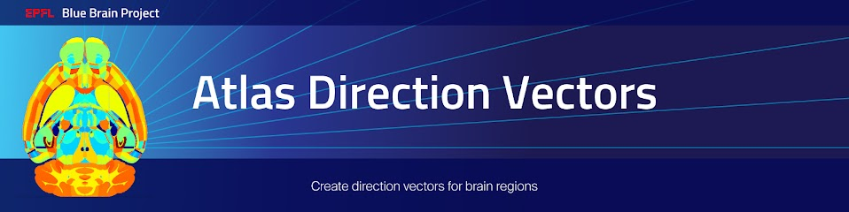

Overview
=========

This project contains the commands which create direction vectors for several brain regions including the cerebellum, the isocortex, and the thalamus of the AIBS P56 mouse brain.

Direction vectors are 3D unit vectors associated to voxels of a brain region.
They represent the directions of the fiber tracts and their streamlines are assumed to cross transversely layers in laminar brain regions.

Direction vectors are used in placement-algorithm to set cells orientations.

Direction vectors are also used to compute placement hints and split layer 2/3 of the AIBS mouse isocortex.

After installation, you can display the available command lines with the following ``bash`` command:

.. code-block:: bash

    atlas-direction-vectors --help

Installation
============

.. code-block:: bash

    pip install atlas-direction-vectors

Examples
========

Direction Vectors
-----------------

Get the required input files:

.. code-block:: bash

   mkdir -p data/ccfv3

   # hierarchy file:
   curl -o data/1.json http://api.brain-map.org/api/v2/structure_graph_download/1.json

   # CCFv3 annotation volume:
   curl -o data/ccfv3/annotation_25.nrrd http://download.alleninstitute.org/informatics-archive/current-release/mouse_ccf/annotation/ccf_2017/annotation_25.nrrd

Run the code (note, depending on the resolution of the volume, this may require significant amounts of available RAM):

.. code-block:: bash

    atlas-direction-vectors direction-vectors isocortex \
        --hierarchy-path data/1.json                    \
        --annotation-path data/ccfv3/annotation_25.nrrd \
        --algorithm shading-blur-gradient               \
        --output-path data/ccfv3/direction_vectors.nrrd

Instructions for developers
===========================

Run the following commands before submitting your code for review:

.. code-block:: bash

    cd atlas-direction-vectors
    isort -l 100 --profile black atlas_direction_vectors tests setup.py
    black -l 100 atlas_direction_vectors tests setup.py

These formatting operations will help you pass the linting check `testenv:lint` defined in `tox.ini`.

Citation
========

When you use this software, we kindly ask you to cite the following DOI:

.. image:: https://zenodo.org/badge/451806460.svg
   :target: https://zenodo.org/badge/latestdoi/451806460

Acknowledgements
================

The development of this software was supported by funding to the Blue Brain Project, a research center of the École polytechnique fédérale de Lausanne (EPFL), from the Swiss government’s ETH Board of the Swiss Federal Institutes of Technology.

For license and authors, see LICENSE.txt and AUTHORS.txt respectively.

Copyright © 2022 Blue Brain Project/EPFL
